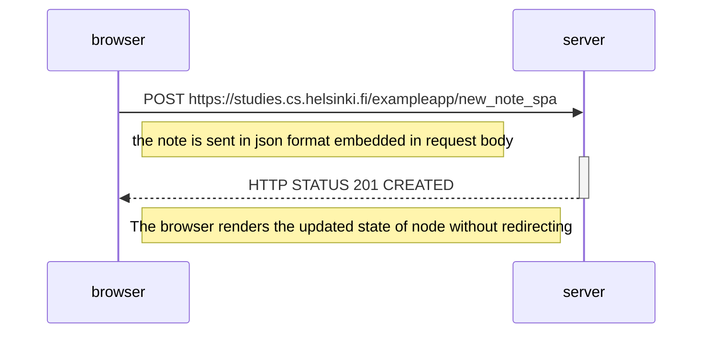

```mermaid
sequenceDiagram
    participant browser
    participant server

    browser->>server: POST https://studies.cs.helsinki.fi/exampleapp/new_note_spa
    Note right of browser: the note is sent in json format embedded in request body

    activate server
    server-->>browser: HTTP STATUS 201 CREATED
    deactivate server


    Note right of browser: The browser renders the updated state of node without redirecting
```